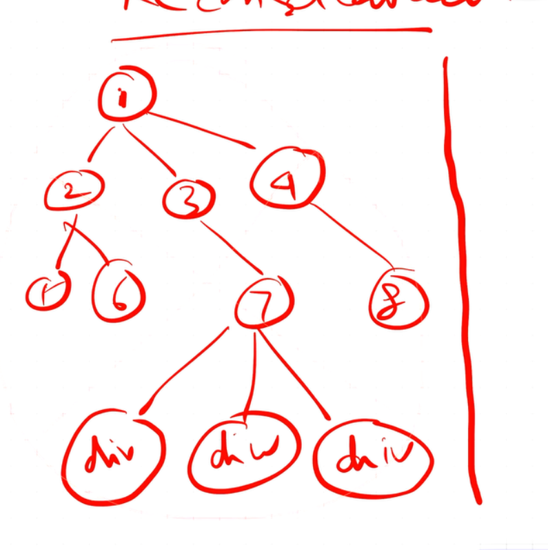
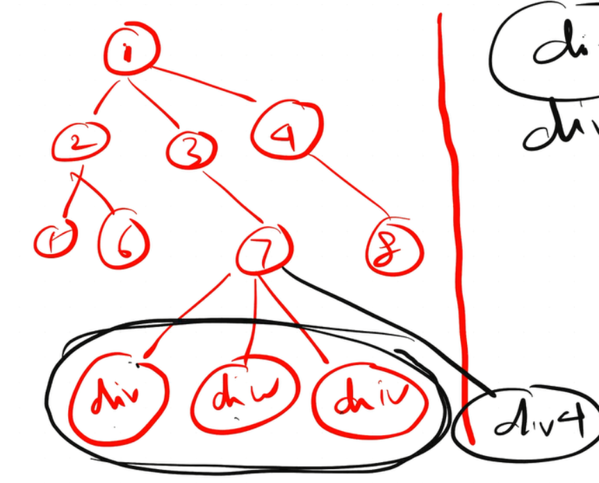

# Welcome to React Learnings :-
- yarn is another alternative of npm
- npm install -D parcel ( As we dont want parcel on production , we want parcel on developer machine , -D=> Dev Dependency , implies we are installing parcel as a dev dependency ) or --save-dev
in package.json:-
- Dependency => All the packages that a project needs
- devDependencies: "^2.8.2"  => ^ implies will upgrade project itself  whenever there will be a updated version( for minor versions for major versions ~ is used)
- ^ =>  Autoupgrade

- but it wil auto upgrade with new updates , to know what exact version we need to use to production we use package.lock.json (It tells what version of the library we are using) , its a proff of the version we used 

- Node_modules:-
WhenEver we install stg it's install in our node_modules so its kind of DB for NPM

- Problem with cdn links:-

This link is for 18 version what if react updated to 19 then we hv to again copy paste links
also fetching data from other's servers wont be a optimized approach

- so npm i react ( will install react in dependencies not in dev-dependencies)
  - npm i react-dom

- to run :- npx parcel index.html

- parcel :-
  - HMR-> hot module Reloading ( parser does this and keeps a track of every file if we change )
  - how it knows the changes -> through file watcher Algo written in c++ all this happens in parcel-cached folder

- dist folder:- when we do npx parcel index.html dist creates a faster dev version of our project servers it on the server (locahost://1234)
  - if I want to make a production built :- using build command :- npx parcel build index.html 

- while doing this ( both for production and non-production)  it does a lot of things all happens inside dist folder 
- parcel:-
  -  HMR :-
    - Hot Module Replacement (HMR) is a feature that enables real-time updates to modules in a running application without requiring a full page reload.
  -  File Watcher Algo
  -  BUNDLING
  -  minify
  - Cleaning our code
  - Dev And Prodcution Build
  - Super Fast Build Algo
  - Image Optimization
  - Caching while development 
  - File Compression
  - Compatble with older versions of  browsers
  - gives functionality to build App on https 
  - (HTTP) on dev-> run npx parcel index.html--https your app will run on https
  - Always put parcel-cache in .gitignore 
  - In package.lock.json :- pacel has its dependecies , its dependencies has its corresponding sobordinate dependencies , (Transitive dependencies)
  - its a Zero config(install and give run and it will do things itself)

- npx-> npm run 
-  Since JSX can only have 1 root we use react.fragment ( Its a component imported by react  we can use it like React.Fragment)  its like an empty tag  instead this we cann write <></> 

- npm run start/ npm start 

##  Talk is Cheap , show me the code 
1. **Header**
   - Logo
   - Nav Items (right side)
   - Cart

<<<<<<< HEAD
<!-- Talk is Cheap , show me the code -->
/* My Food App structure will look like this, 
            1) Header
                - Logo
                - Nav Items(right side)
                - Cart
            2) Body
                - Search bar
                - Restaurants List
                    - Restaurant card
                        - Image
                        - Name
                        - Rating
            3) Footer
                - Links
                - Copyrights
       
*/

this is what I told
=======
2. **Body**
   - Search bar
   - Restaurants List
     - Restaurant card
       - Image
       - Name
       - Rating

3. **Footer**
   - Links
   - Copyrights

### config driven UI :- chanhing casousels ass to city ( dynamic UI)
- bs we dont want seperate websites for each city so we control frontend using config so its called config driven UI 
- If we hv casousels
- list of restraus 
- Offers

* so our data will come like :-

* So according to city backend will render accordingly 

## Virtual DOM :-
its not a React concept , its a programming concept 
- We keep representation of DOM with us 

- Its needed for a process reconciliation in react to implement Deef algo 
- Deef  algo that react uses to differenticate one tree from other 
- And it determines what to change and what not to change and updates changes

- In this tree if there is a change in 7th node it wont rerender entire tree

- Only this much will be rerendered 

- If we add 1 more div here react wont know the order to insert , So whenever we have multiple children with the same attribute , this problem arises 

- Here it thinks we have 5 divs so rerender etg, since it dont know which child got change , since no reference of diffrence if there
- So use key 

- Now react will only rerender div 5

- React fibre is a reconciliation engine ,came in Reacr 16 ,responsible for diff 

- since we have so many nodes in :-
`restaurantList.map((restaurant) =>{
                  return <RestaurantCard {...restaurant.data} />
` so use key
- If we use duplicate key react will give error

## Lets Get Hooked :-
- In default import your can name other that what name is exported  but its good practice to keep same 
- Some people write Header.js as Header.jsx its bs it contains jsx , its also correct 
 
## Exploring the world

-- Shimmer UI was not working bs of 
    const [filteredRestaurants,setFilteredRestaurants] = useState(); 
    make it   const [filteredRestaurants,setFilteredRestaurants] = useState([]); 

## Finding the Path :-
- Instead of building hole package on your own u can use a  package  formik

- Install React Router Dom 

- React-router-dom is such a powerfull library it gives results for unexpected results as well 

- There are two types of routing :-
  -  Server site Routing :- All pages come from server 
  - Client Site Routing :- ex React no network call no need to go to server to fwtch details 
  
  
- Outlet solved the issue 

- IN Functional component :- 
  - render -> useEffect -> rerender 
-IN class component :-
 - we hv constructor , render() , componentDidMount() all these are life cycle methods 
 - contructor -> render ->componentDidMount
 - so the best place for API call :- componentDidMount

  
  

  #190
  

  - cdidUpdate
  

  - Unmount 
  

  - For Other Pages 1 file but for instamart 2 files
  
  - When we load Instamart bund it takes some time to load the script meanwhile react tries to render it ,stg which is not there so in this process react suspends the rendering   
  - It came after 734ms  before that react suspends to handle this suspence is used 